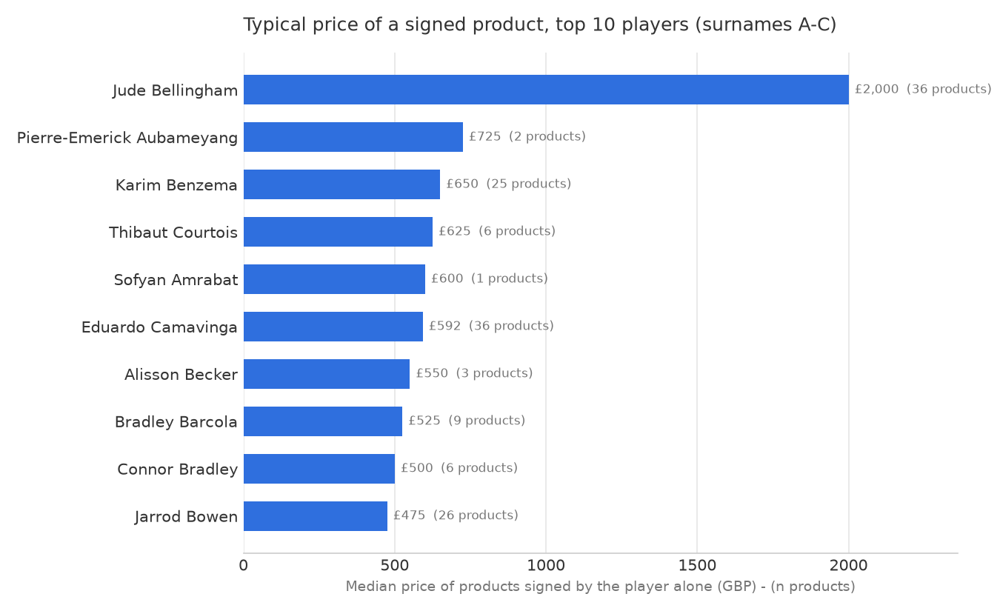

# Whose signature is worth the most? — Findings

**Answer: Jude Bellingham, by a wide margin.**

A product signed by Bellingham typically costs **£2,000** (median of 36
products) — about three times the next player. His most expensive item, an
Official 2026 FIFA World Cup back-signed and hero-framed England shirt, is
**£2,250**, more than double any other A–C player's top item (£1,100).
The result holds like-for-like: comparing signed shirts only, Bellingham's
median is £2,000 against £650 for the runner-up, Karim Benzema.

| Rank | Player | Median price (GBP) | Products | Max item (GBP) |
|---|---|---|---|---|
| 1 | Jude Bellingham | **2,000** | 36 | 2,250 |
| 2 | Pierre-Emerick Aubameyang | 725 | 2 | 750 |
| 3 | Karim Benzema | 650 | 25 | 1,000 |
| 4 | Thibaut Courtois | 625 | 6 | 1,000 |
| 5 | Eduardo Camavinga | 592 | 36 | 1,100 |

*Aubameyang's rank 2 rests on only 2 products; on any reasonable sample,
Benzema is the true runner-up.*

## Method

1. **Collect** (`scrape.py`): automated scrape of icons.com "Current Stars"
   with surnames A–C — 32 qualifying players, 553 product listings
   (542 unique products; 4 players currently list no products), capturing
   Title, Price, Availability, Size, Dispatch Time, Product Type, Signed By
   and Presentation.
2. **Clean** (`clean.py`): numeric prices, trimmed text, duplicates removed,
   helper flags added.
3. **Analyse** (`analyse.py`): "signature value" = prices of products signed
   by that player **alone** (506 rows), so dual-signed items never inflate a
   single player's value. Median is the headline metric because framed and
   unframed versions of the same signature create wide price spreads.

## Notes and caveats

- Prices are icons.com retail listing prices (GBP), collected 18 July 2026 —
  asking prices, not sale prices.
- Dispatch Time is no longer shown per product on the site; it is derived
  from icons.com's own delivery policy (framed items: 1–5 working days,
  everything else: 2 working days).
- Size is blank for products the site lists without any size attribute
  (mainly unframed boots, balls and photos).
- 35 of Bellingham's 36 single-signed products are in stock, so his premium
  reflects live prices, not a few stale rarities.
